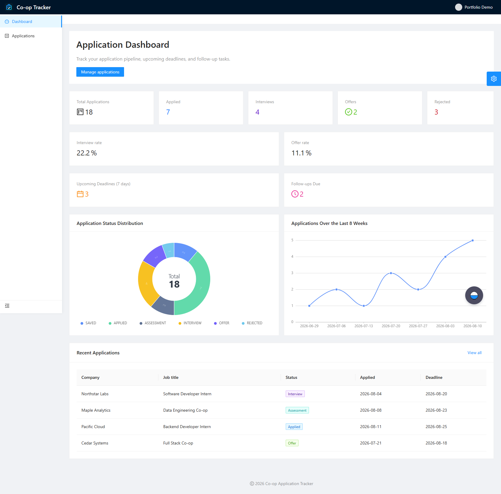
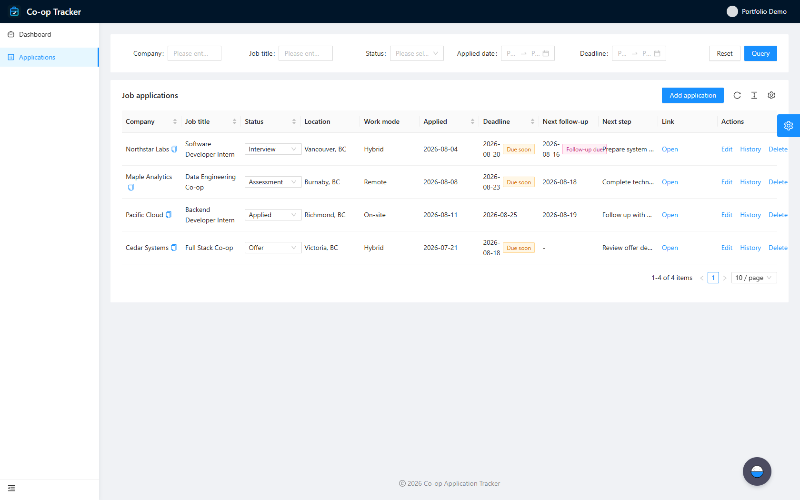
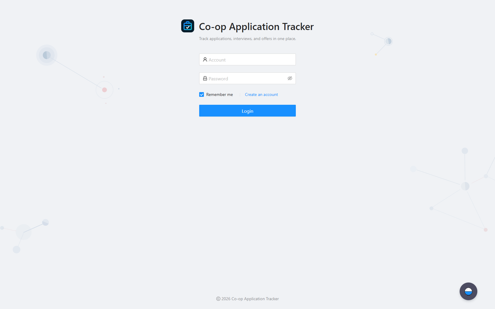
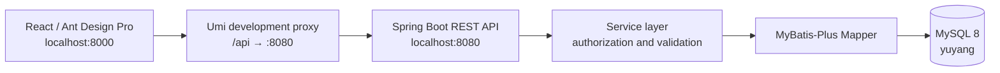

# Co-op Application Tracker

A full-stack application that helps students organize Co-op and internship applications, track deadlines, and understand their job-search progress through a visual dashboard. It includes session-based authentication, application management, status history, deadline reminders, analytics, and administrator user management.

## Features

- User registration, sign-in, sign-out, and session-based authentication
- Create, edit, search, paginate, sort, and soft-delete job applications
- Manage Saved, Applied, Assessment, Interview, Offer, Rejected, and Withdrawn statuses
- Track status changes, deadlines, and follow-up reminders
- View application totals, interview and offer rates, status distribution, and an eight-week trend
- Isolate user data so that users can access only their own applications
- List and delete users through administrator-only controls
- Handle API responses and business exceptions consistently, with MyBatis-Plus pagination

## Screenshots

> The companies, roles, and account shown below are demo data used only to present the interface.

### Application dashboard



### Application management



### Sign-in page



## Tech Stack

| Layer | Technologies |
| --- | --- |
| Frontend | React 17, TypeScript, Umi 3, Ant Design 4, Ant Design Pro, Ant Design Charts |
| Backend | Java 8, Spring Boot 2.6, Spring MVC, MyBatis-Plus 3.5 |
| Database | MySQL 8, InnoDB, utf8mb4 |
| Testing | JUnit 5, Spring Boot Test, Jest / Umi Test |
| Build and deployment | Maven, npm, Nginx, Docker |

## Architecture



The backend stores the authenticated user in an HTTP session. During development, the frontend proxies `/api/*` to the backend and removes the `/api` prefix. For example, `/api/user/login` is forwarded to `http://localhost:8080/user/login`.

## Project Structure

```text
.
├── user-center backend/             # Spring Boot backend
│   ├── sql/                         # Schema and migration scripts
│   └── src/
├── user-center-frontend-master/     # React / Ant Design Pro frontend
│   ├── config/                      # Routes, proxy, and build configuration
│   ├── docker/                      # Nginx configuration
│   └── src/
└── docs/images/                     # README screenshots
```

## Local Development

### 1. Prerequisites

- JDK 8 or later
- Maven 3.8+
- MySQL 8.x
- Node.js 16 LTS (the project declares Node.js 10 as its minimum version)
- npm 8+

The application uses these ports by default:

| Service | Address |
| --- | --- |
| Frontend development server | `http://localhost:8000` |
| Backend API | `http://localhost:8080` |
| MySQL | `localhost:13306` |

If MySQL uses its standard port, `3306`, override the default connection address through `DB_URL`.

### 2. Initialize the Database

Use a database administrator account to create the database, then create a dedicated account for the application. Never commit a real password to Git.

```sql
CREATE DATABASE IF NOT EXISTS yuyang
  CHARACTER SET utf8mb4
  COLLATE utf8mb4_unicode_ci;

CREATE USER IF NOT EXISTS 'user_center'@'localhost'
  IDENTIFIED BY 'replace-with-a-strong-password';

GRANT SELECT, INSERT, UPDATE, DELETE
  ON yuyang.* TO 'user_center'@'localhost';
FLUSH PRIVILEGES;
```

Next, enter the backend directory and connect with a migration account that has permission to create tables:

```bash
cd "user-center backend"
mysql -h 127.0.0.1 -P 13306 -u root -p yuyang
```

Run the SQL scripts in this order:

```sql
SOURCE sql/create_tables.sql;
SOURCE sql/create_job_application.sql;
SOURCE sql/create_application_status_history.sql;
SHOW TABLES;
```

The scripts create the user, job application, and status history tables respectively. The final script also backfills an initial status event for existing applications, so it must run last.

### 3. Configure and Start the Backend

The backend reads its database configuration from environment variables:

| Variable | Required | Default | Description |
| --- | --- | --- | --- |
| `DB_URL` | No | `jdbc:mysql://localhost:13306/yuyang` | JDBC connection URL |
| `DB_USERNAME` | No | `user_center` | Dedicated application database account |
| `DB_PASSWORD` | Yes | Empty | Database password; do not store it in a config file or commit it |
| `SPRING_PROFILES_ACTIVE` | No | Not set | Set to `prod` to enable the production configuration |

PowerShell:

```powershell
cd "user-center backend"
$env:DB_URL = "jdbc:mysql://localhost:13306/yuyang"
$env:DB_USERNAME = "user_center"
$env:DB_PASSWORD = "your-local-password"
mvn spring-boot:run
```

Bash / zsh:

```bash
cd "user-center backend"
export DB_URL="jdbc:mysql://localhost:13306/yuyang"
export DB_USERNAME="user_center"
export DB_PASSWORD="your-local-password"
mvn spring-boot:run
```

The backend is available at `http://localhost:8080`. A business error returned when an unauthenticated client calls a protected endpoint is expected.

### 4. Start the Frontend

Open another terminal:

```bash
cd user-center-frontend-master
npm ci
npm start
```

Open `http://localhost:8000` in a browser. The development proxy already targets `http://localhost:8080`, so no additional API URL configuration is required.

## Testing and Quality Checks

Before running backend tests, confirm that the test database is reachable and that the tables have been initialized. Database-writing tests run within transactions and should not retain test data.

```bash
cd "user-center backend"
mvn test
```

Run the frontend unit tests, type and style checks, and production build with:

```bash
cd user-center-frontend-master
npm test -- --runInBand
npm run lint
npm run build
```

## Database Backup and Restore Test

The examples below use the MySQL command-line tools. Backups may contain personal information, so keep them in a controlled location and never commit them to Git.

### Create a Backup

Create a local `backups` directory, then run:

```bash
mysqldump --host=127.0.0.1 --port=13306 --user=user_center --password \
  --single-transaction --quick --no-tablespaces --set-gtid-purged=OFF \
  --result-file=backups/yuyang_YYYY-MM-DD.sql yuyang
```

The `--password` option prompts for the password interactively, keeping it out of shell history. After the backup completes, check the output file size and regularly verify the backup by restoring it into a separate database.

### Restore into an Isolated Test Database

Do not overwrite the active database. First, create a dedicated restore-test database with an administrator account:

```bash
mysql --host=127.0.0.1 --port=13306 --user=root --password \
  --execute="DROP DATABASE IF EXISTS yuyang_restore_test; CREATE DATABASE yuyang_restore_test CHARACTER SET utf8mb4 COLLATE utf8mb4_unicode_ci;"

mysql --host=127.0.0.1 --port=13306 --user=root --password \
  yuyang_restore_test --execute="SOURCE backups/yuyang_YYYY-MM-DD.sql"
```

Verify the tables, key record counts, and character encoding:

```bash
mysql --host=127.0.0.1 --port=13306 --user=root --password \
  yuyang_restore_test --execute="SHOW TABLES; SELECT COUNT(*) AS users FROM user; SELECT COUNT(*) AS applications FROM job_application; SELECT COUNT(*) AS status_events FROM application_status_history;"
```

After confirming the restore, have an administrator remove the temporary database. For production, use a separate backup account, encrypted storage, and an off-site retention policy.

## Security and Deployment Notes

- The application uses a dedicated database account, and real credentials are injected only through environment variables.
- `.gitignore` excludes local environment files, build output, logs, archives, and dependency directories.
- User passwords are currently stored as salted server-side hashes. Before production use, migrate to an adaptive password hashing algorithm such as BCrypt or Argon2.
- Domain configuration, HTTPS, the reverse proxy, and closing public database/backend ports require a deployment server and are intentionally deferred until deployment preparation.
- In production, expose only HTTPS publicly. Nginx should forward `/api/` to a backend service bound to a private or loopback interface, and MySQL must not be exposed directly to the internet.

## Roadmap

- Add Service, Controller, and frontend integration test coverage
- Add continuous integration checks and publish the project to GitHub
- Configure the domain, HTTPS, minimal public port exposure, and production deployment after a server is available
